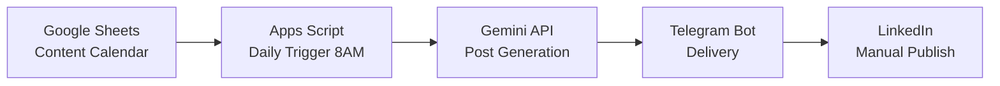

# AI LinkedIn Content Pipeline for IT Businesses

A serverless, zero-cost content automation engine for B2B IT companies.
It turns a Google Sheets calendar into daily brand-voice LinkedIn posts,
delivered to your Telegram — powered by **Google Apps Script + Gemini**.

Built and running in production at [AsanAbr](https://asanabr.ir),
an Iranian cloud & managed IT services provider.

## ✨ Features

- 📅 **One-year calendar generator** — 365 topics from 15 services × 25 angles
- 🤖 **Brand-voice posts** — hook → insight → solution → slogan → CTA
- 🌐 **Bilingual hashtags** — Persian + English for wider reach
- ⏰ **Timezone-aware trigger** — daily at 8:00 AM (Asia/Tehran)
- 🛡 **Anti-duplicate delivery** — status tracking in Sheets
- 📱 **Bulletproof Telegram delivery** — 4000-char safe, graceful degradation
- 🧩 **Zero dependencies** — 100% Apps Script, free-tier friendly

## 🏗 Architecture

## 🚀 Quick Start (5 minutes)

1. Create a Google Sheet with a tab named `تقویم`
2. Open **Extensions → Apps Script** and paste `Code.gs`
3. Fill your keys in `CONFIG` (see `config.example.gs`)
4. Run in order: `setupSheet()` → `seedYear()` → `setupTrigger()`
5. Done — a fresh post arrives in Telegram every day at 8 AM ☀️

Full instructions: [docs/setup-guide.md](docs/setup-guide.md)

## 📸 Sample Output

See [samples/sample-posts.md](samples/sample-posts.md)

## 🗺 Roadmap

- [ ] Pluggable AI image providers
- [ ] LinkedIn auto-publish (OAuth)
- [ ] Impressions feedback loop → topic scoring
- [ ] Multi-brand templates

## 🤝 Contributing

Issues and PRs are welcome. For major changes, open an issue first.

## 📄 License

MIT — see [LICENSE](LICENSE).

## 👤 Author

**Pedram Zamanian** — Microsoft System Administrator, Founder of AsanAbr